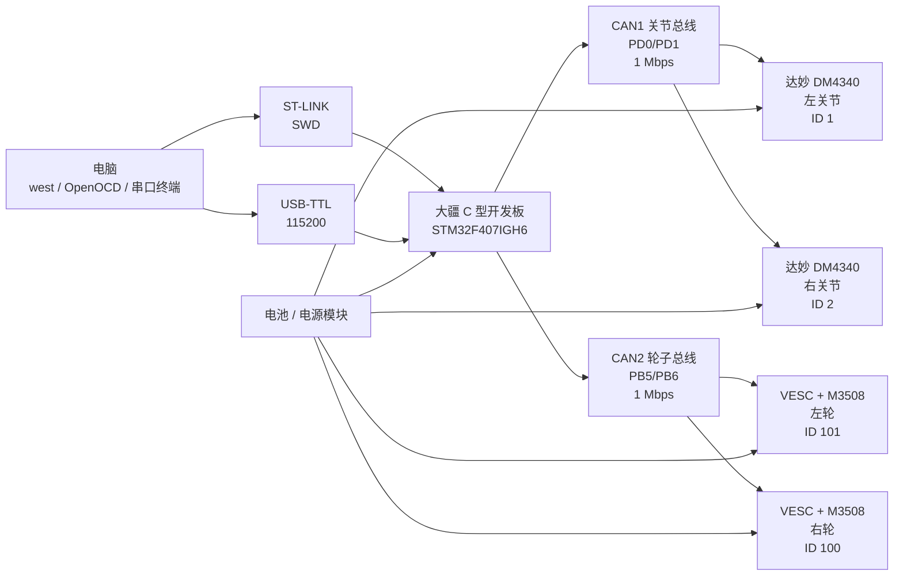

# 双 CAN 接线、编译、烧录

本文档对应工程：

```text
/home/h/code_leg/zephyr_ascento_f407_wheel_leg
```

## 1. 总体接线

默认固定双 CAN：

- CAN1：达妙 DM4340/关节侧，1 Mbps
- CAN2：VESC/M3508/轮子侧，1 Mbps，VESC 扩展帧



## 2. CAN1：达妙关节

| C 板 | STM32 引脚 | 连接到 |
| --- | --- | --- |
| CAN1_RX | PD0 | C 板 CAN1 收发器 |
| CAN1_TX | PD1 | C 板 CAN1 收发器 |
| CAN1_H | 板载 CAN1_H | 两个达妙关节 CAN_H |
| CAN1_L | 板载 CAN1_L | 两个达妙关节 CAN_L |
| GND | GND | 达妙关节控制地 |

默认 ID：

```text
左关节 DM4340 ID 1
右关节 DM4340 ID 2
Master ID 0x00
```

## 3. CAN2：VESC/M3508 轮子

| C 板 | STM32 引脚 | 连接到 |
| --- | --- | --- |
| CAN2_RX | PB5 | C 板 CAN2 收发器 |
| CAN2_TX | PB6 | C 板 CAN2 收发器 |
| CAN2_H | 板载 CAN2_H | 两个 VESC CAN_H |
| CAN2_L | 板载 CAN2_L | 两个 VESC CAN_L |
| GND | GND | VESC 控制地 |

默认 ID：

```text
左轮 VESC/M3508 Controller ID 101
右轮 VESC/M3508 Controller ID 100
```

VESC Tool 里需要设置：

```text
CAN Baud: 1 Mbps
CAN Mode: VESC
CAN Status 1: 200 Hz
```

两条 CAN 都要注意：

- CAN_H/CAN_L 不要接反。
- 每条总线两端各 120 欧终端电阻。
- C 板、电调、达妙电机必须共地。
- 尽量走线型总线，少做长分叉。

## 4. ST-LINK

| ST-LINK | C 板 |
| --- | --- |
| SWDIO | SWDIO |
| SWCLK | SWCLK |
| GND | GND |
| 3V3 sense | 3V3 |
| NRST，可选 | NRST |

ST-LINK 的 3V3 建议只做电压检测，不要给整车供电。

## 5. 串口 Shell

固件默认使用 USART1：

| USB-TTL | C 板 / STM32 |
| --- | --- |
| RX | PA9 / USART1_TX |
| TX | PB7 / USART1_RX |
| GND | GND |
| 波特率 | 115200 |

## 6. 编译

```bash
cd /home/h/code_leg/zephyr_ascento_f407_wheel_leg
source /home/h/code/zephyr_robot/zephyr/zephyr-env.sh
west build -b dji_f407igh6_c -p always .
```

## 7. 烧录

```bash
west flash --runner openocd
```

也可以直接调用 OpenOCD：

```bash
openocd -f boards/arm/dji_f407igh6_c/support/openocd.cfg \
        -c "program build/zephyr/zephyr.elf verify reset exit"
```

## 8. 单电机调试

先看两条 CAN 状态：

```text
motor can status all
```

单独测试达妙关节：

```text
motor dm status all
motor dm enable left
motor dm pos left 0.10 1.0 800
motor dm enable right
motor dm pos right -0.10 1.0 800
motor dm stop left
motor dm stop right
```

单独测试 M3508 轮子，务必架空：

```text
motor wheel status all
motor wheel current left 100 300
motor wheel current right 100 300
motor wheel rpm left 500 300
motor wheel pair 100 100 300
motor wheel stop
```

全部调试输出清零：

```text
motor debug stop
robot enable 0
```

## 9. 整机上电顺序

1. 只接 C 板、ST-LINK、USB-TTL，先烧录。
2. 串口确认 shell 正常。
3. 只接 CAN1 达妙关节，逐个测试左右关节。
4. 只接 CAN2 轮子，逐个测试左右轮。
5. 两条 CAN 都接好后，执行 `robot height 38`、`robot height 60`。
6. 架空轮子，执行 `robot enable 1`，轻推机身确认轮子补偿方向。
7. 如果轮子越倒越推，立刻 `robot enable 0`，再调整轮子电流符号或 IMU pitch 符号。
8. 小电流、小角度调 PID，确认安全后再落地。
